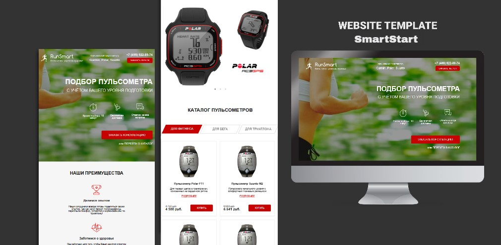

<h2 align="center">
  RunSmart 
  <a href="https://sonyatls.github.io/RunSmart" target="_blank">sonyatls.github.io/RunSmart</a>
</h2>

  

 

 &nbsp;
 &nbsp;

## Built With
В данном проекте использовались следующие технологии:

- Node.js
- HTML5
- CSS3
- VsCode
- Gulp

## Преимущества

**📱 Полностью адаптивный**
